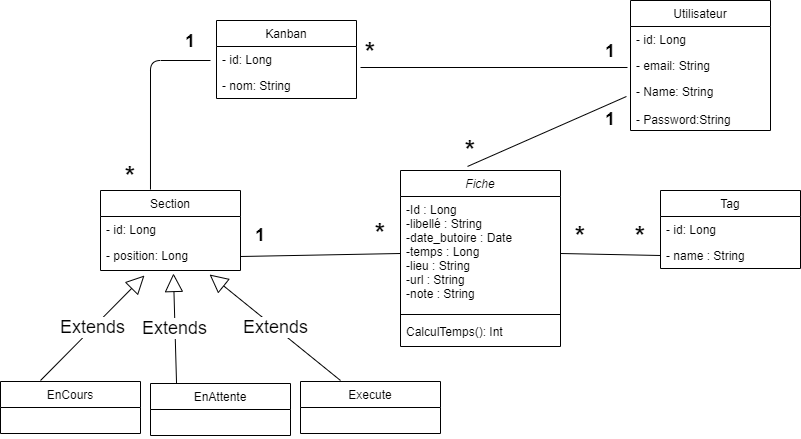
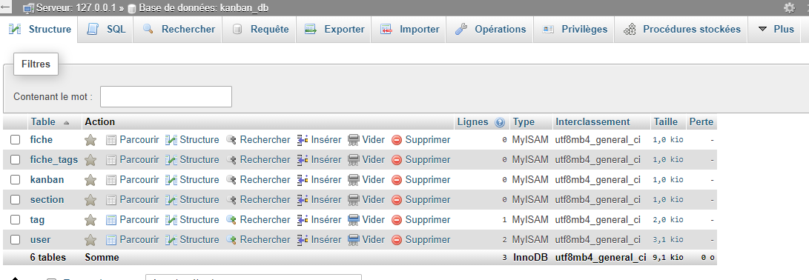
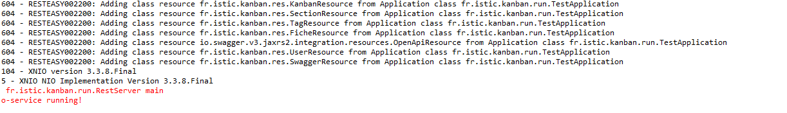
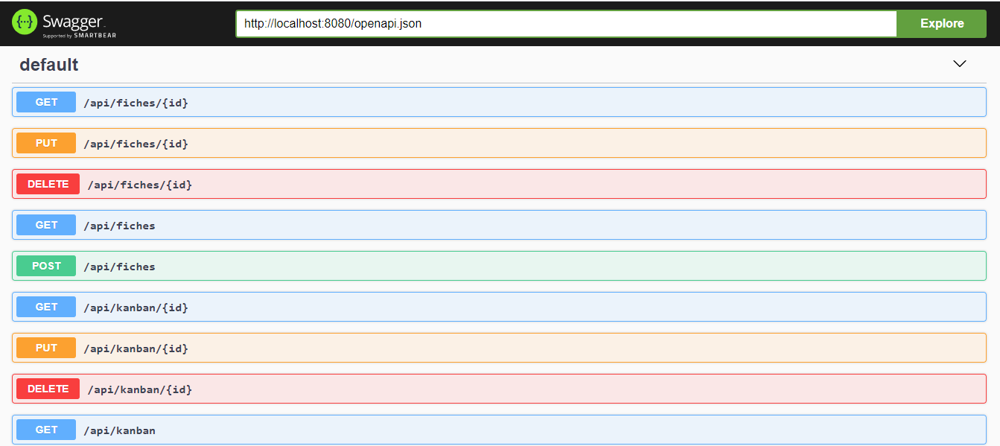
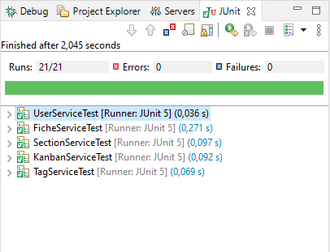

# TP projet pour le TP2-4 & TP5 JPA 2021 Univ-Rennes 1 / ISTIC

## Etudiants du Groupe 2D:  
- [TSIVANYO Kodjo Nuwoza](https://marctsivanyo.github.io/)
- [Sadou BARRY](https://github.com/sabari2018)

## Dépôt Git du projet   

Backend : [Branche kanban](https://github.com/MarcTSIVANYO/SIR_TP/tree/kanban)


## Diagramme uml du projet kanban

   

## Configuration et run du backend

##### 1. Configuration du fichier persistance.xml
Ajouter le fichier de  configuration src/main/resources/META_INF/persistance.xml les informations (l'hôte, nom de l'utilisateur, le mot de passe et le nom de la base de données) pour la connexion à la base de données.


*En cas de problème de type java.sql.SQLException : The server time zone value CSET ...; Il faut ajouter dans le fichier de configuration persistance.xml:*

```<persistence-unit name="mysql">
       <properties>
          ..
           <property name="hibernate.connection.url" value="jdbc:mysql://localhost/DATABASENAME?serverTimezone=UTC"/>
         ..
       </properties>
   </persistence-unit> 
```

##### 2. Création et initialisation de la base de données  

    1. Executer JpaRun pour peupler la base.
    2. Executer TestN1Select pour faire une requête en chargement paresseux (problème du n+1 select)
    3. Executer TestJointFetch pour faire une requête en chargement au plus tôt (sans le problème du n+1 select)


##### 2. Lancer le web service
  * **Exécuter le RestServer (fr.istic.kanban.run/RestServer) pour lancer le serveur**
    
   
  * **Lien swagger pour tester l'api kanban, http://localhost:8080/api/#/ : [Swagger](http://localhost:8080/api/#/)**
    
    
#### 3. Données json pour tester l'api
* **Inserer dans la table user (One by one)**

 ```
 {
  "name": "Sandy Beininck",
  "email": "sbeininck0@g.co",
  "password": "rDVVizlR0P"
}
{
  "name": "Cross Scolding",
  "email": "cscolding1@howstuffworks.com",
  "password": "6keyrn"
}
{
  "name": "Gussie Rowson",
  "email": "growson2@yahoo.co.jp",
  "password": "vREI7U"
} 
```


* **Inserer dans la table Tag (One by one)**

```
{
  "name": "Engineering"
}
{
  "name": "Engineering"
}
{
  "name": "Business Development"
}
{
  "name": "Accounting"
}
{
  "name": "Services"
}
```


## Technos 

 ```bash
  Java
  Junit 5
  MySql, Postgresql local
  Azure Database pour PostgreSQL & MySQL
  SonarQube
  Swagger
  Eclipse
  Postman
 ```

### Période
 - Février - Avril 2021
 - Mise à jour le 1er Avril 2021
 
### Junit test capture


